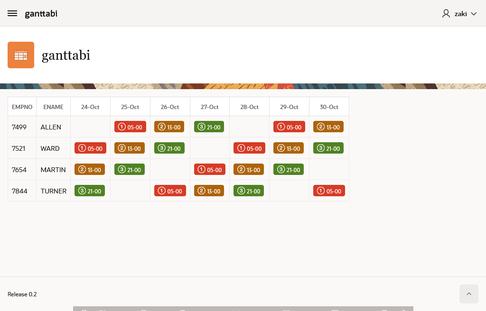

# Gantt Like Table APEX Template Component

## Description

A sample illustration using apex template component (single) to draw a gantt like table.

The main purpose is to represent a schedule by ressources in a table (not a chart), like employee weekly schedule by day/shift.

## Demo

- [Demo application Link](https://apex.oracle.com/pls/apex/r/hachemi/ganttabi/home)
- username : demo
- password : password123

## Instructions

1. create a **ganttabi** region using a query like :

        SELECT
            json_arrayagg(
                JSON_OBJECT( 
                    EMPNO,
                    ENAME,
                    shift,
                    'css_class' value case shift 
                                        when 1 then 't-Badge--danger'
                                        when 2 then 't-Badge--warning'
                                        when 3 then 't-Badge--success'
                                    end ,
                    'icon'  value case shift                                                    
                                        when 1 then 'fa-number-1-o'
                                        when 2 then 'fa-number-2-o'
                                        when 3 then 'fa-number-3-o'
                                end ,
                    'scheduledtime' value h_start,
                    'scheduledtime_disp' value to_char(h_start,'HH24-MI')
            )  order by empno, shift )
            
            empschedule
        FROM
        emp_SCHEDULE

2. Edit **Data Placeholder** so it include the column containing the json array
3. Edit **Date Column Name** so it include the time property (scheduledtime)
4. Edit **Left Columns Names** so it include the colon separated properties to be included in the report
5. Edit **Gtc AttributXX Column** corresponding to the template

## About

Initialy the plugin was buit using web custom elements, but the css style inheritance.

The plugin send the json array returned by the query to javascript, where it will be reformated(pivoted) and grouped. The partial template will be used to fill an html table.

Using Template component may be not the best choice for such table, but it can be considered as reference (bad or good).

## known Issues

- size limit
- null date
- lazy loading

## Credits and Special Thanks

I am fully thankfull to the valuable shares, blogs and vlogs by :

- Philip Hartenfeller. https://github.com/phartenfeller
- John Dixon. https://blog.cloudnueva.com/
- Menno Hoogendijk. https://github.com/mennooo
- APEX team

Additionally, I specify the recipients of my assistance in their pursuit of improvement ;) 

- [you.com](https://you.com)
- [chat.openai.com](https://chat.openai.com)
